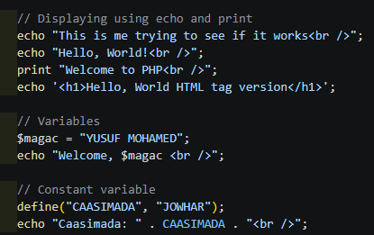
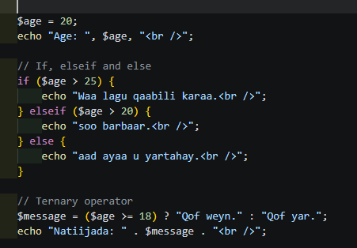
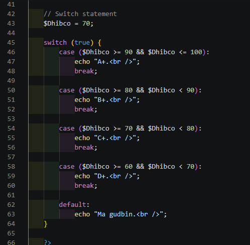

# PHP Programming Screenshots

This folder contains screenshots demonstrating PHP programming concepts covered in the practice.

# PHP Practice Screenshots

This folder contains screenshots explaining the basic concepts used in the PHP practice:

**PHP Programming Practice**

---

# 1. PHP Output, Variables and Constants

## Screenshot Name

`PHP_Output_Variables_Constants.png`

## Description

This screenshot demonstrates basic PHP output and data storage concepts.

Main concepts covered:

- `echo` is used to display output.
- `print` is used to display output.
- PHP can generate HTML output.
- Variables are created using the `$` symbol.
- Constants can be created using `define()`.

Examples:

```php
echo "Hello, World!";

print "Welcome to PHP";

$magac = "YUSUF MOHAMED";

define("CAASIMADA", "JOWHAR");
```

## Screenshot



---

# 2. PHP If, Elseif, Else and Ternary Operator

## Screenshot Name

`PHP_Conditions_Ternary.png`

## Description

This screenshot demonstrates conditional statements and the ternary operator.

Main concepts covered:

- `if` checks a condition.
- `elseif` checks another condition when the previous condition is false.
- `else` runs when the previous conditions are false.
- The ternary operator provides a short way to write a simple condition.

### If, Elseif and Else Example

```php
if ($age > 25) {
    echo "Waa lagu qaabili karaa.";
} elseif ($age > 20) {
    echo "soo barbaar.";
} else {
    echo "aad ayaa u yartahay.";
}
```

### Ternary Operator Example

```php
$message = ($age >= 18) ? "Qof weyn." : "Qof yar.";

echo "Ternary Result: " . $message;
```

## Screenshot



---

# 3. PHP Switch Statement

## Screenshot Name

`PHP_Switch_Statement.png`

## Description

This screenshot demonstrates the use of a `switch` statement for checking the value of a student's score.

The practice uses:

- `switch`
- `case`
- `break`
- `default`
- Score conditions

Example:

```php
$Dhibco = 70;

switch (true) {
    case ($Dhibco >= 90 && $Dhibco <= 100):
        echo "A+.";
        break;

    case ($Dhibco >= 80 && $Dhibco < 90):
        echo "B+.";
        break;

    case ($Dhibco >= 70 && $Dhibco < 80):
        echo "C+.";
        break;

    case ($Dhibco >= 60 && $Dhibco < 70):
        echo "D+.";
        break;

    default:
        echo "Ma gudbin.";
}
```

## Screenshot



---
